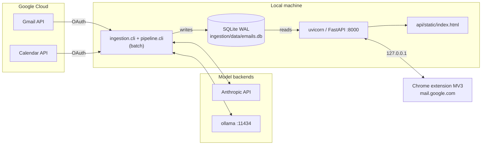
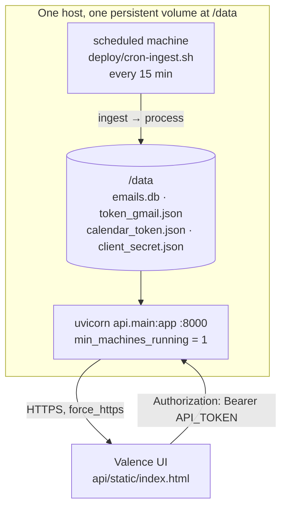
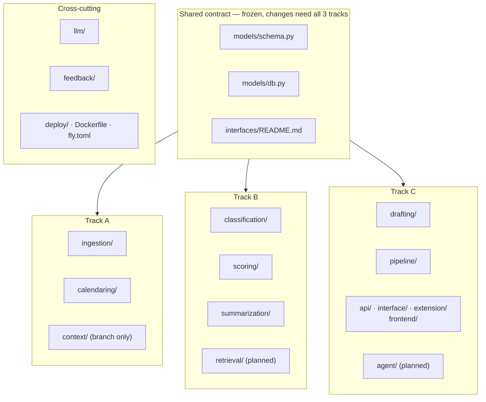
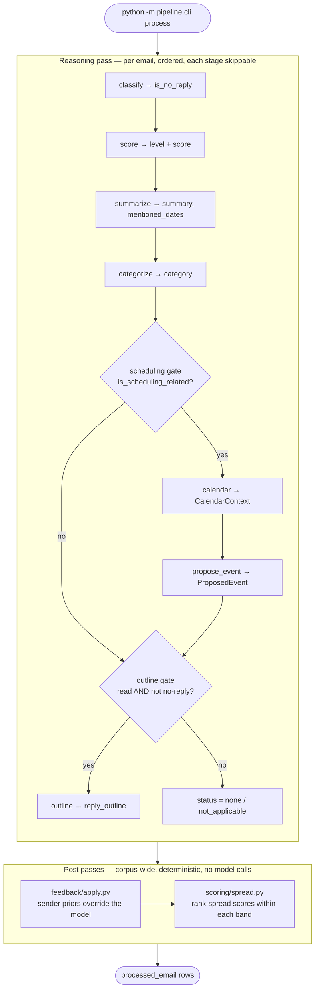
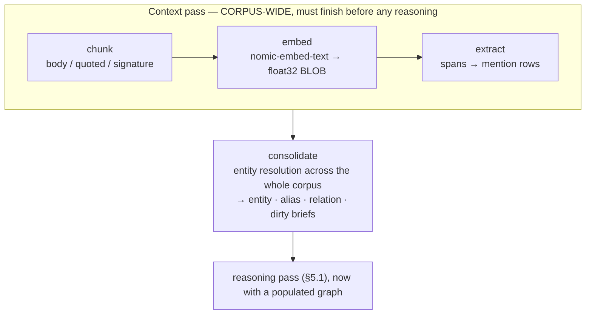
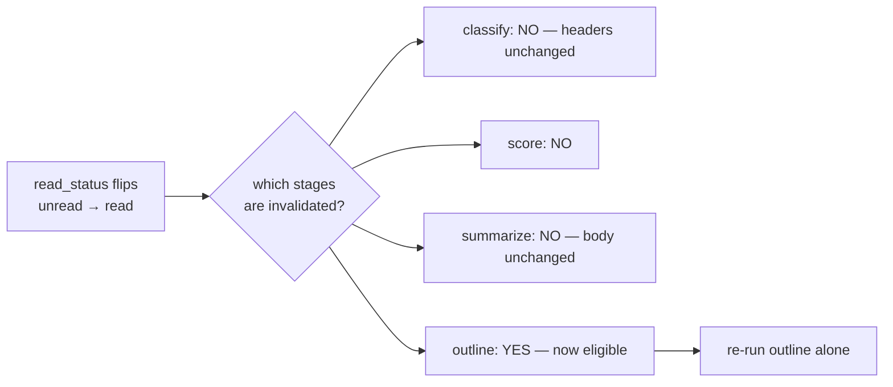
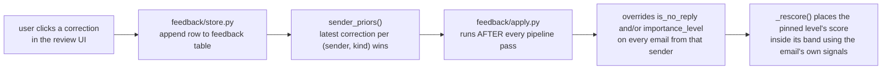

# ARCHITECTURE.md — Valence

The system architecture for the Valence AI email agent. This is the technical
source of truth: what runs, how data moves, where state lives, which decisions
were made and what was rejected.

**Written against `main`.** `track-a-context`, `context-graph-b`, and
`track-c-agent` have all been merged: `context/`, `llm/embeddings.py`,
`retrieval/`, and `agent/` are on `main`. Sections below still carrying a
🚧 `<branch>` marker are describing where a component came from, not where
it lives — the per-component ✅/🚧 status has not been re-judged since the
merge, so treat those markers as "landed, completeness unreviewed".

**Not yet wired (INT1).** The two-pass driver is still open: `outline`,
`summarize`, and `score` accept a `ContextPack` but the pipeline does not
build or pass one, and `agent/tools.py` still serves `agent/fixtures.py`
demo data rather than the real graph.

**Companion docs.** `PRODUCT.md` (who it's for), `DESIGN.md` (the visual
system), `CONTEXT.md` (track ownership + the original 8-phase plan),
`PHASES-COMPLEX.md` (the context-graph/agent build plan),
`interfaces/README.md` (per-module function signatures), `FILE-TREE.md`
(directory layout), `deploy/README.md` (hosting).

**Status legend.**

| Mark | Meaning |
|---|---|
| ✅ | On `main`, tested, running |
| 🚧 | Built on a track branch, not yet merged to `main` |
| 📋 | Specified in `PHASES-COMPLEX.md`, not yet built anywhere |

---

## 1. The thesis

Valence is a **batch-processing pipeline with a thin serving layer**. That
split is the single most important architectural fact about it, and almost
everything else follows from it.

Processing an inbox costs minutes and many model calls. Serving a ranked queue
costs milliseconds and reads rows a batch job already wrote. Keeping those two
workloads apart means:

- No HTTP request ever blocks on the pipeline, so there is no job queue, no
  worker pool, no long request timeouts, and no websocket needed.
- The API is stateless over SQLite in WAL mode, so it can be restarted, moved,
  or replaced without touching the pipeline.
- A pipeline failure degrades the product to "stale data" rather than "down".
- Scheduling is somebody else's problem: cron runs the batch job, and the API
  never knows.

The second-most important fact: **hard rules live in code, never in prompts.**
Whether an email is eligible for a reply outline, whether a no-reply email can
be scored urgent, whether the user's correction beats the model — all of that
is deterministic Python that runs *after* the model has spoken. A prompt
instruction drifts, especially on a small local model. A code gate does not.

The third: **nothing is ever sent, and nothing is ever written to Calendar,
without an explicit human action.** There is no send endpoint at all, and the
agent has no send tool. See §9.4.

---

## 2. Deployment topology

There are two supported topologies, and the difference matters because a
remote client cannot reach `localhost`.

### 2.1 Local development ✅

Everything on one machine. `API_TOKEN` unset, so auth is disabled.



### 2.2 Hosted ✅

Reaching the API from anywhere but the local machine needs a real host.
SQLite is a file, not a network service, so the batch
pipeline that writes it and the API that reads it must run on the same host
sharing one disk. `fly.toml` + `Dockerfile` + `deploy/cron-ingest.sh` are a
worked example; any host with a persistent volume and a cron facility works.



Key deployment facts:

| Fact | Where | Why |
|---|---|---|
| One volume shared by API and pipeline | `fly.toml [mounts]` | SQLite is a file; both processes need the same disk |
| `auto_stop_machines = false` | `fly.toml` | A stopped machine can't serve the add-on |
| All paths point at `/data` | `EMAIL_AGENT_DB`, `GMAIL_TOKEN_FILE`, `CALENDAR_TOKEN_FILE`, `*_CREDENTIALS_FILE` | One convention, so nothing writes to ephemeral container disk |
| Secrets never in `fly.toml` | `fly secrets set API_TOKEN=… ANTHROPIC_API_KEY=…` | `fly.toml` is committed |
| OAuth consent happens **locally, once** | `deploy/README.md` step 1 | `InstalledAppFlow` needs a real browser; refresh tokens work headlessly afterward |
| Deployed pipeline uses Anthropic, not ollama | `deploy/README.md` step 4 | A small cloud host can't run a local model well |

> **Environment split worth knowing.** Local development is Python 3.9.6; the
> `Dockerfile` builds on `python:3.12-slim`. The 3.9 constraints that shape the
> code (no `enable_load_extension` in this interpreter's `sqlite3`, `from
> __future__ import annotations` everywhere) are local facts, not container
> facts. Code must satisfy the stricter of the two.

### 2.3 Runtime processes

| Process | Command | Lifetime | Status |
|---|---|---|---|
| Ingestion | `python -m ingestion.cli ingest` | Seconds–minutes | ✅ |
| Reasoning pipeline | `python -m pipeline.cli process` | Minutes | ✅ |
| API server | `uvicorn api.main:app --port 8000` | Long-running | ✅ |
| Scheduled refresh | `deploy/cron-ingest.sh` | Per interval, exits | ✅ |
| ollama | `ollama serve` | Long-running | ✅ optional |
| Context pass | `python -m context.cli build` | Minutes | 🚧 `track-a-context` |

---

## 3. Client surfaces

Four clients read the same API. This is a real architectural surface, not an
implementation detail, because they have different auth stories.

| Client | Tech | Status | Sends `Authorization: Bearer`? |
|---|---|---|---|
| **Valence web UI** — `api/static/index.html` | One self-contained HTML file, no build step, served by the API at `/` | ✅ | **Yes** — prompts for the token and stores it |
| **Chrome extension** — `extension/` | MV3, content scripts injected into `mail.google.com`; adds an "Ask" tab on `track-c-agent` | ✅ / 🚧 | **No** — see §13 |
| **React app** — `frontend/` | Vite + React 18 + TypeScript + Tailwind, `lucide-react` icons | ✅ | **No** — see §13 |

The extension is the only client that cannot call the API directly: Gmail's
page CSP blocks it, so every request funnels through `background.js`, which
uses `host_permissions` instead. That proxy is why the extension needs a
second, port-based transport for streaming (§7.6).

The add-on is Apps Script, a fundamentally different runtime from the rest of
the repo, so it is deliberately not wired into `pytest` or `requirements.txt`.
Apps Script's `UrlFetchApp` is not a browser and is not subject to CORS, which
is why the add-on needs no entry in the API's origin list.

CORS is an explicit allow-list (`localhost:3000`, `localhost:5173`, and the
127.0.0.1 equivalents) plus a comma-separated `EXTRA_ORIGINS` env var for the
deployed origin — never `*`, so deploying is a config change rather than a
security review.

---

## 4. Component map and ownership

Three people, three branches, disjoint folders, one frozen contract. The
ownership boundary is enforced socially — a PR touching another track's folder
is a signal the split is wrong, not a merge.



| Module | Track | Responsibility | Key constraint | Status |
|---|---|---|---|---|
| `models/schema.py` | shared | The frozen dataclass contract | Append-only. All datetimes tz-aware UTC. Graph types `frozen=True`. | ✅ |
| `models/db.py` | shared | Connection factory, all DDL, forward migrations | Nothing calls `sqlite3.connect` directly | ✅ |
| `ingestion/` | A | Gmail OAuth, paginated fetch, MIME→plaintext | `backoff.py` is the repo's one retry policy | ✅ |
| `calendaring/` | A | Free/busy, slot suggestion, intent, event propose/create/update/cancel | Not `calendar/` — that shadows the stdlib | ✅ |
| `classification/` | B | No-reply detection, topic categorization | Header rules first; the model is the fallback | ✅ |
| `scoring/` | B | Signals → LLM level → in-band score → rank spread | Score and level can never disagree | ✅ |
| `summarization/` | B | Summaries + `mentioned_dates`, batched | Dates are captured verbatim — no parsing, no inference | ✅ |
| `drafting/` | C | Outlines behind a code gate, calendar-aware bullets, expand | `is_eligible()` is pure and side-effect free | ✅ |
| `pipeline/` | C | Two-pass orchestration, incremental re-run, staleness, persistence | No prompts and no SQL — it sequences other tracks | ✅ |
| `api/` | C | FastAPI, bearer auth, CORS, static UI | Read-mostly; every `/api/*` route carries `Depends(require_token)` | ✅ |
| `interface/` | C | Review CLI + shared filters | — | ✅ |
| `extension/`, `frontend/` | C | The two non-static clients | See §3 | ✅ |
| `llm/` | cross | Provider abstraction, per-stage routing, prompt helpers | Every model call goes through `get_client(stage)` | ✅ |
| `feedback/` | cross | Sender priors from user corrections | Runs after the model; the correction has the last word | ✅ |
| `deploy/`, `Dockerfile`, `fly.toml` | cross | Hosting, scheduled refresh | Cron is the only scheduler; the API never triggers processing | ✅ |
| `context/` | A | Chunking, embeddings, entity extraction + resolution, graph | Only `BODY` chunks are embedded and mined | 🚧 `track-a-context` |
| `retrieval/` | B | Hybrid search, RRF fusion, `build_pack()`, briefs | The single entry point every context consumer calls | 📋 |
| `agent/` | C | Nine tools, Claude tool-use loop, conversation persistence | Tools are the only way the agent touches data | 🚧 `track-c-agent` |

---

## 5. Data flow

### 5.1 The reasoning pipeline ✅



**Why every stage is wrapped.** One email failing classification must not abort
a 100-email run. A stage failure leaves its field `None`, which is exactly what
"not processed yet" looks like, so the next run retries it. This is why
nullable columns matter: they distinguish *unprocessed* from *processed, result
was none*.

**Why the post-passes are last, and deterministic.** Score spreading is a
property of the whole inbox, not of one email — no single-email prompt can
produce separation. Feedback priors must beat the model, so they run after it.

### 5.2 The context pass 🚧

`pipeline/orchestrate.py` on `main` already declares
`CONTEXT_STAGES = ("chunk", "embed", "extract")` and `ProcessedEmail` carries
`context_processed_at`, but the `context/` package that implements those stages
lives on `track-a-context`. The contract is frozen; the implementation is not
merged.



**Why two passes and not one longer stage list.** Extraction builds the entity
graph the reasoning stages retrieve from. Interleave them per email and email
#1's outline is generated against a graph that knows only about email #1, while
email #160's sees everything. The correlation the graph exists to provide would
be available to the last message in a run and absent from the first. Hence two
entry points (`run_context`, then `process`), and hence `CONTEXT_STAGES` is
deliberately *not* appended to `STAGES`.

### 5.3 Incremental re-run ✅

Reprocessing 100 emails because one was marked read costs ~100× more than it
should. `pipeline/incremental.py` answers two questions: does this email need
work at all, and if so, which stages.



A stage is also "due" when its output field is still unset — the `_STAGE_OUTPUT`
map is the mapping from stage name to the field it fills.

Two completion markers, deliberately separate:

- `processed_at` — set each time the reasoning pass runs.
- `context_processed_at` — set once chunk → embed → extract has completed. The
  context stages write `chunk`/`chunk_vec`/`mention` rows rather than any
  `ProcessedEmail` field, so this is their only completion marker. It is *not*
  tied to `processed_at` on purpose: a read-status flip must never invalidate
  the context pass.

Terminal states are never re-run: an `APPROVED` `ProposedEvent` may already
carry a live `google_event_id`, and `DECLINED` is a recorded user decision, not
a value the pipeline owns.

### 5.4 Serving path ✅


Every mutating endpoint is per-email and human-triggered. **None of them is
ever called by the batch pipeline**, and there is no send-email endpoint at all.

### 5.5 Agent chat 🚧 `track-c-agent`

```mermaid
sequenceDiagram
    participant U as User (Ask tab in Gmail)
    participant BG as extension/background.js<br/>port "agent-chat"
    participant API as POST /api/agent/chat
    participant CV as agent/conversation.py
    participant L as agent/loop.py
    participant T as agent/tools.py
    participant M as Claude

    U->>BG: message
    BG->>API: POST (SSE)
    API->>CV: create if needed; append user turn
    CV-->>API: full history
    loop until stop_reason != "tool_use", max 8 turns
        API->>L: run(messages)
        L->>M: messages.create(tools=TOOL_SPECS)
        M-->>L: tool_use block
        L->>T: dispatch(name, args)
        T-->>L: bounded JSON result
        L-->>API: tool_start / tool_end / text_delta
        API-->>BG: data: {...}
    end
    L-->>API: done + new_messages
    API->>CV: append every generated turn
    API-->>BG: data: {"type":"done","conversationId":…}
```

### 5.6 Planned: retrieval 📋

```
raw_email ──chunk──> chunk ──embed──> chunk_vec        (local nomic-embed-text)
                       ├──fts───────> chunk_fts        (FTS5, free)
                       └─extract────> mention ──resolve──> entity ──> relation
                                                              │
                                              consolidate ────┴──> node_brief
                                                                   (thread/case/project/person)
                                          ┌───────────────────────────┘
                       retrieval.pack ────┤  BM25 + vector + graph-walk, RRF-fused
                                          └──> ContextPack (char-budgeted, cited)
                                                    │
                        ┌───────────────────────────┼──────────────────┐
                   outline.py              summarize.py           agent/loop.py
                (context-aware)         (context-aware)        (Claude tool loop)
```

`ContextPack` is the *only* shape an LLM prompt ever sees context in. That
gives exactly one place where a character budget is enforced and exactly one
place where provenance is attached.

---

## 6. Data model and storage

### 6.1 Why SQLite

One user, read-mostly serving. WAL mode lets the API read while the pipeline
writes — the only concurrency requirement there is. Everything goes through
`models/db.py:connect()` and the DDL registry, so moving to Postgres later
means changing one module rather than hunting `sqlite3.connect` across the repo.

The cost of that choice is visible in §2.2: because SQLite is a file, the API
and the batch job are pinned to the same host and the same volume. That is the
tradeoff, and it is accepted deliberately at this scale.

### 6.2 Core tables ✅

| Table | Grain | Purpose | Indexes |
|---|---|---|---|
| `raw_email` | 1 per message | Ingestion output. Plaintext body, headers as JSON, label ids, attachment flag. | `received_at DESC`, `thread_id` |
| `processed_email` | 1 per message | Everything derived. Nullable = stage hasn't run. | `importance_score DESC`, `received_at DESC`, `read_status` |
| `feedback` | 1 per correction | Append-only event log of user corrections. | `(sender, kind, created_at)` |

`processed_email` columns worth calling out:

| Column | Written by | Note |
|---|---|---|
| `mentioned_dates` | summarize | JSON array of date strings **verbatim from the email** — no parsing, no inference. `NULL` until summarized, `[]` once summarized with none found. |
| `calendar_context`, `proposed_event` | calendar, propose_event | JSON blobs of the corresponding dataclass |
| `proposed_event_status` | pipeline + approve/decline endpoints | `NOT NULL DEFAULT 'none'` |
| `reply_outline` | outline | JSON array of bullet strings |
| `processed_at` | reasoning pass | Re-set every run |
| `context_processed_at` | context pass | Independent of `processed_at` — see §5.3 |

### 6.3 Context graph tables ✅ (contract frozen on `main`)

Eleven tables, all created by `CREATE TABLE IF NOT EXISTS`, mirroring
`models/schema.py` 1:1. The DDL is on `main`; the code that populates it is on
`track-a-context`.

| Table | Purpose | Notable constraint |
|---|---|---|
| `chunk` | One embeddable span of one email | `kind ∈ (body, quoted, signature)` |
| `chunk_fts` | FTS5 external-content index over `chunk.text` | The three sync triggers are **mandatory**, not a convenience — without them index and table drift silently and `MATCH` returns rows whose text no longer exists |
| `chunk_vec` | float32 LE BLOB per chunk, with `dim` | `dim` stored alongside so a model swap is detectable |
| `entity` | Resolved graph node | `UNIQUE (kind, normalized_key)` — scoped by kind so a PERSON "Atlas" and a PROJECT "Atlas" never collapse; `CHECK` on the seven kinds |
| `entity_alias` | Every surface form ever seen | Lets a later mention match without an embedding comparison |
| `entity_vec` | Entity name embedding, for fuzzy resolution | — |
| `mention` | One occurrence of one entity in one email | `source ∈ (header, regex, llm)` — a bad regex is a different fix from a hallucination |
| `relation` | Weighted, evidenced edge | PK `(src, dst, rel)`; `CHECK` on the four edge kinds; `evidence_email_ids` is what makes an edge auditable |
| `node_brief` | Cached LLM-written state doc per thread/case/project/person | PK `(node_type, node_id)`; `evidence_hash` is the cache key |
| `agent_conversation`, `agent_message` | The in-app agent's chat log | In the DB because Gmail is a SPA that remounts content scripts constantly |

### 6.4 Vectors without a vector extension

The local interpreter's `sqlite3` is built **without** `enable_load_extension`,
so `sqlite-vec` and `sqlite-vss` cannot be loaded at all. Vectors are therefore
float32 little-endian BLOBs, read into one contiguous numpy matrix, with
brute-force cosine.

Sizing check: ~160 emails ≈ ~1,500 chunks × 768 dims × 4 bytes ≈ **4.6 MB**.
A dot product over that is ~5 ms. An ANN index would be complexity with no
payoff. FTS5 *is* available and is used for real.

### 6.5 Migrations

Two mechanisms, deliberately separate:

- **New tables** → `CREATE TABLE IF NOT EXISTS` in `ALL_SCHEMAS`. Adding a
  table is not a migration.
- **New columns on a shipped table** → an entry in the `MIGRATIONS` dict,
  applied on every open. A database written by an earlier version keeps working
  instead of failing on an unknown column.

`prepare()` is cheap and idempotent, so call sites just call it rather than
tracking whether initialization already happened.

### 6.6 Schema invariants

1. **Every datetime in the contract is timezone-aware UTC.** `received_at`
   comes from Gmail's `internalDate`, an absolute instant. Mixing naive and
   aware datetimes raises `TypeError` on comparison — a defect that once made
   `scoring/signals.py` crash on real mail. `datetime.utcnow()` is banned.
2. **`None` means "not processed yet", never "processed, result was none".**
   This is what makes retry-on-next-run correct. `mentioned_dates` follows it
   exactly: `None` unprocessed, `[]` processed with nothing found.
3. **`_level_from_score(importance_score) == importance_level`** always. Score
   spreading preserves it; feedback rescoring preserves it.
4. **A no-reply email never holds a `reply_outline`.** Enforced in the outline
   gate *and* re-enforced in `feedback/apply.py`.
5. **Context-graph dataclasses are `frozen=True`.** Unlike `ProcessedEmail`
   (filled in field by field as stages run), a `Chunk` or `Mention` is derived
   wholly in one pass and then only ever replaced. Use `dataclasses.replace`.

---

## 7. The LLM layer

### 7.1 Provider abstraction

One function — `llm.client.get_client(stage)` — returns an Anthropic-shaped
client, real or local. Both backends expose
`.messages.create(model=, max_tokens=, system=, messages=, output_config=)`
and return an object whose `.content` is a list of blocks with `.type` and
`.text`. Call sites are identical; only config differs.

Before this, four call sites each constructed `anthropic.Anthropic()` directly,
so switching providers meant editing four files.

### 7.2 Per-stage routing

```bash
export LLM_PROVIDER=ollama                # default backend for everything
export LLM_PROVIDER_OUTLINE=anthropic     # …except outlines
export LLM_MODEL_EXTRACT=claude-sonnet-5  # …and extraction uses a cheaper model
```

Routable stages: `classify`, `score`, `summarize`, `categorize`, `outline`,
`extract`, `brief`, `agent`. The hybrid split is the point — high-volume
mechanical work can run against a local model for free while the handful of
calls where judgment is visible stay hosted. Two environment variables, not a
code branch. `python -m llm.cli describe` prints the resolved routing.

| Setting | Default | Why this value |
|---|---|---|
| `ANTHROPIC_MODEL` | `claude-opus-5` | — |
| `OLLAMA_MODEL` | `llama3.1:8b` | — |
| `OLLAMA_HOST` | `http://localhost:11434` | A plain URL, so localhost / LAN / Tailscale are all the same to this code |
| `OLLAMA_TIMEOUT` | `300`s | Generous on purpose — a cold model load must not read as a failure |
| `OLLAMA_REPEAT_PENALTY` | `1.3` | Without it a small model loops inside a JSON string under constrained decoding and burns the whole token budget without closing the quote |
| `EMBED_MODEL` | `nomic-embed-text` | 768 dims, local, free (🚧 branch) |
| `MAX_BODY_CHARS` | `2000` | Measured: the two biggest bodies in a 12-email run were the two misjudged levels |

`llm/ollama.py` has **no tool-calling support**. The planned agent loop is
Anthropic-only.

### 7.3 The reason-before-answer rule

Every JSON schema for a model call must declare its reasoning field **before**
the answer field:

```python
RESPONSE_SCHEMA = {
    "type": "object",
    "properties": {
        "justification": {"type": "string", "maxLength": 300},  # FIRST
        "importance_level": {"type": "string", "enum": [...]},   # SECOND
    },
    "required": ["justification", "importance_level"],
    "additionalProperties": False,
}
```

Under constrained decoding the model emits fields in declaration order. Reason
first means the reasoning *informs* the answer. Answer first means the level is
committed and the reasoning merely rationalizes it. This is not a style
preference — do not "tidy" the order.

Every string field carries a `maxLength`, which constrained decoding enforces
structurally. That makes a repetition loop inside a string field impossible,
which is a real failure mode on small local models.

### 7.4 Prompt construction

`llm/prompting.py:email_identity_block` builds the From/To/Subject header every
stage uses, so identity formatting is defined once. Email-address parsing
reuses `_addr_only` from `scoring/signals.py` rather than each module
re-implementing it.

### 7.5 Planned: hybrid retrieval 📋

Three channels into the same graph, fused with Reciprocal Rank Fusion:

| Channel | Answers | Fails at |
|---|---|---|
| **BM25** (FTS5) | exact terms — ticket IDs, PO numbers, names | paraphrase |
| **Vector** (cosine over `chunk_vec`) | paraphrase, fallback recall | short corpora, identity joins |
| **Graph walk** (`relation` edges, ranked by `salience`) | "everything touching this case" with certainty | anything not yet extracted |

Fusion is RRF because the three channels produce incomparable scores — BM25
magnitudes and cosine similarities cannot be linearly combined without an
arbitrary calibration constant. Rank-based fusion sidesteps that entirely.

`build_pack()` then assembles a char-budgeted `ContextPack` of labelled
`ContextSection`s. Each section carries provenance ("From X, date, re: Y")
because without it a model blurs facts from several emails together instead of
citing them, and a wrong claim can't be traced to its source.

### 7.6 The in-app agent 🚧 `track-c-agent`

Person C's PR (`3834fa5`, items C1–C8) adds `agent/` plus the endpoints and
extension surface that drive it. Reviewed here as proposed architecture.

**Nine tools, each reusing an existing implementation** rather than
reimplementing it — the DRY rule applied to a tool layer:

| Tool | Backed by | Real or stub |
|---|---|---|
| `get_email` | `pipeline.persist.get` + `ingestion.store.get` | real |
| `list_queue` | `api.filters.apply_filters` / `sort_emails` | real |
| `draft_reply` | `drafting.expand.expand_outline_to_full_draft` | real |
| `summarize_selection` | `pipeline.persist.get` per id + one LLM call | real |
| `search_context` | `agent/fixtures.py` → swap to `retrieval.pack.build_pack` | stub, one line |
| `get_thread_brief` | `agent/fixtures.py` → `retrieval.briefs.get_brief` | stub |
| `get_entity_brief` | `agent/fixtures.py` | stub |
| `list_entities` | `agent/fixtures.py` → `context.store.*` | stub |
| `find_open_items` | `agent/fixtures.py` | stub |

Four tools are real today; five are fixture-backed with the swap site marked,
because they depend on Tracks A and B. That is the right shape for a track that
must ship before its dependencies merge — the interface is real, only the data
source is temporary.

**Everything a tool returns is bounded and JSON-serializable.** `MAX_BODY_CHARS
4000`, `MAX_TEXT_CHARS 1200`, `MAX_LIST_ITEMS 25`, `MAX_QUEUE_ITEMS 50`,
`MAX_SUMMARIZE_SELECTION_IDS 20`. An unbounded `get_email` on a 5,000-char body
blows the loop's context window by turn three. `dispatch()` catches every
exception a tool raises and returns `{"error": …}` instead of propagating, so
one bad tool call doesn't abort the turn — the same graceful-degradation
posture as `orchestrate.py`'s `_run_stage`.

**The loop guards against a silent failure mode.**
`OllamaToolsUnsupportedError` is raised *before any API call* if the `agent`
stage resolves to ollama, because `llm/ollama.py`'s `create()` swallows unknown
kwargs via `**_ignored` — including `tools=`. Without the guard, an
ollama-routed agent would answer confidently having called no tools at all,
which is strictly worse than an explicit failure. This is the same instinct as
the outline gate: make the impossible state unrepresentable rather than hoping.

**The system prompt carries the one rule that can't be a code gate:** cite
`email_id` for any claim about a specific email, and never claim to have sent
anything. The hard half is still structural — there is no send tool.

**Streaming is at turn granularity, not token.** One `text_delta` per assistant
turn, plus `tool_start`/`tool_end` around each call, using the same
non-streaming `messages.create()` shape every other call site in the repo uses.
Across up to 8 turns that is real incremental progress, and it avoids
introducing a token-level streaming API nothing else here uses.

**Transport.** `POST /api/agent/chat` returns Server-Sent Events, one JSON
object per `data:` line. The extension can't use its normal
`chrome.runtime.sendMessage` proxy for this — that can't stream, and a reply
with 8 tool turns can take 20+ seconds, which reads as broken. So
`background.js` gains a second transport: one `chrome.runtime.connect({name:
"agent-chat"})` port per message, closed by the returned disposer if the user
navigates away mid-stream.

**A provider misconfiguration surfaces inside the stream**, as
`{"type": "error", …}`, not as an HTTP status — by the time the failure is
known, the 200 has already started. Worth knowing when debugging: a broken
agent looks like a normal response containing an error event.

**Conversation state round-trips through SQLite** on every turn rather than
living in memory, because the panel is injected into Gmail, a SPA that remounts
content scripts constantly (ADR-016).

**XSS discipline.** All model output in `ask.js` goes through `textContent`,
never `innerHTML`. This renders arbitrary model text inside the user's mail
client — the highest-consequence injection surface in the product.

**Also in this PR:** `GET /api/emails/{id}` now returns `relatedContext` —
case/project entities mentioned in the email plus other emails sharing them,
read with real SQL against `mention`/`entity`. It is real wiring that returns
empty until Track A's extraction populates those tables. The extension renders
it as context chips, and gains the sender-priors feedback UI, which is now the
only interface for that feature.

---

## 8. Learning and adaptation

**No model weights are trained anywhere in this system.** There is no training
set, no fine-tuning job, no gradient descent, no evaluation harness producing
checkpoints. Every model involved is used as-is:

| Model | Role | Provenance |
|---|---|---|
| `claude-opus-5` / `claude-sonnet-5` | Classification fallback, scoring, summarization, extraction, outlines, agent loop | Hosted, frozen weights, prompted only |
| `llama3.1:8b` | Optional local substitute for the same stages | Downloaded via ollama, unmodified |
| `nomic-embed-text` | Embeddings for chunks and entity names | Downloaded via ollama, unmodified |

What *does* adapt is everything around the models. There are five distinct
mechanisms, and conflating them is the main risk when reasoning about behavior.

### 8.1 Sender priors — the real feedback loop ✅

The only mechanism that learns from the user.



Two correction kinds: `level` (pin this sender to low/medium/high/urgent) and
`no_reply` (this sender is automated / is a real person).

**Why deterministic priors and not few-shot prompt examples.** The measured
misclassifications are *sender-shaped* — a tracker, an order bot, a newsletter
the rules call "personal". A stored override fixes every future email from that
sender with certainty. No prompt example can promise that on a small model, and
adding examples to a prompt makes every future call more expensive forever.
This is the same philosophy as the outline gate: user-stated rules live in code.

Note the invariant maintenance in `apply.py` — pinning a sender to no-reply also
clears any existing outline and sets status to `not_applicable`, because rule 4
of §6.6 must hold after the override, not just before it.

### 8.2 Hand-tuned rule signals ✅

`scoring/signals.py` computes VIP membership, direct-vs-CC, urgency keyword
hits, thread recency, and unread-aging decay. These are **configured**, not
learned. The within-band weights are hand-set constants that sum to 1.0:

| Signal | Weight | Note |
|---|---|---|
| `is_vip` | 0.30 | |
| `urgency` | 0.30 | up to 3 keyword hits count |
| `is_direct` | 0.20 | direct recipient beats CC |
| `unread_age` | 0.15 | saturates at 72h unread |
| `recency` | 0.05 | fresher mail ranks slightly higher |

Changing these is a code change reviewed like any other, not a training run.

### 8.3 The score/level split ✅

Worth its own subsection because it is easy to misread as a scoring model.

The **LLM picks the level** (low/medium/high/urgent) from four calibration
anchors baked into the system prompt. The level selects a 25-point band
(`LEVEL_BANDS`). Then `_score_within_band()` places a **deterministic** score
inside that band using the rule signals above.

```
LLM  →  level  →  band  →  rule signals  →  score
    (judgment)           (arithmetic)

low 0–25 │ medium 25–50 │ high 50–75 │ urgent 75–100
```

This is why score and level can never disagree, and why the numeric score is
reproducible from stored signals without another model call. The model is
never asked for a number — models are poor at calibrated numeric output and
would cluster everything around 70.

### 8.4 Corpus-relative rank spreading ✅

`scoring/spread.py` fixes a problem no per-email scorer can: any scorer
produces clustered scores, because similar emails carry similar signals. The
last measured run put every email between 20 and 34 with big ties at exactly
0.0 and 25.0. Ranking needs *separation*, and separation is a property of the
whole inbox.

So after scoring, within each level, scores are re-mapped to an even
distribution across that level's band, preserving the order the raw scores
(and recency, as tiebreak) established. The level never changes, scores stay
strictly inside their band, and the mapping is idempotent.

### 8.5 Threshold tuning 🚧

Entity resolution has two thresholds that were set empirically against the
`CORPUS-WORLD.md` test corpus, not learned:

| Constant | Value | Meaning |
|---|---|---|
| `DEFAULT_THRESHOLD` | 0.86 | cosine similarity to merge two entity candidates |
| `CONTAINMENT_THRESHOLD` | 0.65 | relaxed bar, applied *only* when one key is a whole-token subsequence of the other ("Henderson escalation" ⊂ "the Henderson escalation issue") |

Tuning these is A7 in `PHASES-COMPLEX.md` and is done by inspecting the graph
via `python -m context.cli`, which is explicitly the go/no-go gate before
anything downstream is trusted.

### 8.6 What would count as training, and why we don't do it

A learned importance ranker is plausible — the `feedback` table is exactly the
label store you'd need. It is not worth it at this scale: one user, ~160
emails, and a handful of corrections. A logistic regression over five signals
fit on twelve labels is noise. The deterministic prior gets the same outcome
with certainty and zero infrastructure. Revisit if the feedback table reaches
hundreds of rows across many senders.

---

## 9. Security, auth, and human-in-the-loop

### 9.1 API authentication

`api/auth.py:require_token` is a FastAPI dependency attached to **every**
`/api/*` route. It compares the `Authorization` header against
`Bearer <API_TOKEN>` and raises 401 on mismatch.

```python
if expected is None:
    return   # AUTH_DISABLED: no token configured, e.g. local dev
```

That fallback is the important detail: **an unset `API_TOKEN` disables auth
entirely.** Convenient locally, and correct there — but it means the security
of a deployment rests on remembering to set one secret. `deploy/README.md`
makes it step 4, and the health check in its "Verifying" section is the way to
confirm it took.

`GET /` (the static UI) is deliberately unauthenticated — it has to load before
the user can enter a token.

### 9.2 OAuth scopes

Two separate token files, because Google issues one token per scope set.

| Service | Scopes requested | Code paths that exist today |
|---|---|---|
| Gmail | `gmail.readonly`, `gmail.send` | read only — `gmail.send` is requested but **never called** |
| Calendar | `calendar.readonly`, `calendar.events` | read, plus create/update/cancel reachable only via explicit user approval |

Write scopes are requested at first consent on purpose: the alternative is
prompting the user for a second consent screen when send ships, which is a
worse experience for no security benefit. **Requesting a scope is not
exercising it** — the write code paths are separately gated.

Consent itself happens locally, once, through `InstalledAppFlow`. Refresh
tokens then work headlessly, which is why the deployed host never needs a
browser.

### 9.3 Secrets

`client_secret_*.json`, `token.json`, `token_calendar.json`, `token_gmail.json`,
and `.env` are all gitignored — verified, nothing matching is tracked.
`ingestion/data/` — the full text of the user's mail — is also gitignored. In
the hosted topology all of these live on the mounted volume at `/data`, never
in the image; `API_TOKEN` and `ANTHROPIC_API_KEY` are set via `fly secrets`,
never in the committed `fly.toml`.

### 9.4 Human-in-the-loop invariants

Product-critical and enforced structurally:

| Invariant | Enforced by |
|---|---|
| Nothing is ever sent automatically | No send endpoint exists anywhere; `expand` produces a preview only |
| No calendar event is created without an explicit click | `ProposedEventStatus` starts at `suggested`; `create_event` is called only from the approve endpoint |
| Rename / reschedule / cancel of an approved event is also explicit | Separate `update` and `cancel` endpoints, one tap each |
| Unread mail never gets a reply outline | `drafting/outline.py:is_eligible` — pure function, tested |
| No-reply mail never gets a reply outline, ever | Same gate, plus re-enforced in `feedback/apply.py` |
| Unclassified mail is treated as ineligible | Same gate — a `None` `is_no_reply` must not let a no-reply email slip through |
| A user-approved or user-declined event is never overwritten | `_TERMINAL_EVENT_STATUSES` in `orchestrate.py` |
| The batch pipeline never calls a mutating endpoint | Mutating endpoints are per-email and human-triggered by construction |
| The agent cannot send mail 🚧 | No send tool exists in `TOOL_SPECS`; `draft_reply` returns a draft. The system prompt reinforces it, but the structural guarantee is the missing tool. |

### 9.5 Extension attack surface

MV3, `host_permissions` restricted to `http://127.0.0.1/*` and
`http://localhost/*`, content scripts matched to `https://mail.google.com/*`
only, `permissions: ["storage"]` and nothing else. The extension cannot reach
any remote host.

---

## 10. Failure modes and degradation

The governing rule from Phase 8: **graceful degradation over crashes.**

| Failure | Behavior | Recovery |
|---|---|---|
| One email fails a stage | That field stays `None`; run continues | Next run retries that stage for that email |
| Gmail rate limit (429) | Exponential backoff in `ingestion/backoff.py` | Automatic |
| Calendar API down | `calendaring/retry.py` (wraps the same backoff); on exhaustion `calendar_context` stays `None` | Email still ranks, summarizes, and gets a non-calendar-aware outline |
| ollama not running | The stage fails; others continue | Start ollama, or switch `LLM_PROVIDER=anthropic` |
| Model returns malformed JSON | Constrained decoding prevents most; a bad response fails only that email's stage | Next run |
| Email with no body / attachments only | Parsed to empty string; stages handle it | — |
| New message in a thread with an existing outline | `pipeline/staleness.py:find_stale_outlines` computes staleness from `thread_id` + `received_at` | Surfaced in the UI; regenerate on demand |
| Pipeline crashes mid-run | Rows already written are committed; nothing left half-written per email | Re-run; incremental logic skips completed work |
| API and pipeline run concurrently | WAL mode — API reads while pipeline writes | — |
| Cron run fails on the host | Data goes stale by one interval; the API keeps serving | Next scheduled run |
| Host machine stops | `auto_stop_machines = false`, `min_machines_running = 1` | Configuration prevents it |

There is no persisted "stale" status, because `ReplyOutlineStatus` is part of
the frozen contract and adding a member needs all three tracks' sign-off. It is
computed at read time from data already present.

---

## 11. Performance and cost

| Operation | Cost |
|---|---|
| Serving one queue page | milliseconds — indexed SELECT |
| Vector similarity over the whole corpus | ~5 ms (brute-force numpy) |
| Ingest 50 emails | seconds |
| Full pipeline over 160 emails | minutes — dominated by model calls |
| Expand one outline to a draft | one synchronous model call |
| Cron interval (example) | 15 minutes — the staleness ceiling for the add-on |

| Model workload | Calls |
|---|---|
| One-time entity extraction over the corpus | ~160 (a mid-tier model is correct; Opus is overkill for span extraction) |
| Embeddings | ~1,500 texts, local, free |
| Initial rollup briefs | ~30–60, then only dirty nodes |
| Steady state | one extraction call per new email, plus affected briefs only |
| Per email per full reasoning pass | up to 5 — several skipped by gates |

The two gates that save the most: the **scheduling gate** (most mail isn't
scheduling-related, so most emails never touch the Calendar API) and the
**outline gate** (unread and no-reply mail never reaches the outline model call
at all). The `evidence_hash` on `node_brief` is the third — an unchanged hash
means the brief is still true, so regenerating it would be a paid call for no
new information.

---

## 12. Testing strategy

**538 tests on `main`.** Branches add their own suites: 748 on
`track-a-context` (the `context/` package), 592 on `track-c-agent` (`agent/`
plus the new API endpoints). All offline: no network, no model calls, no
Google API. `agent/fixtures.py` is what lets the agent suite run with no
Track A or Track B data present.

| Pattern | Where |
|---|---|
| Scripted service doubles | `calendaring/tests/fakes.py` — the reference pattern |
| Shared fixtures, not per-test duplicates | `calendaring/samples.py` serves both the CLI's `--offline` mode and the tests |
| Pure functions isolated for the bug-prone parts | `calendaring/timeutils.py` — RFC-3339 offsets, all-day dates, overlapping busy blocks, tz-correct working hours |
| Gate correctness as explicit assertions | `drafting/tests/test_outline_gating.py` covers unread / no-reply / eligible / scheduling |
| Idempotence and invariants | `scoring/tests/test_spread.py` asserts spreading twice is a no-op and levels never change |

`pytest -q` is the gate before any "I'm done". The Apps Script add-on is
deliberately outside it — a different runtime entirely.

---

## 13. Known gaps

Ordered roughly by how much they'd surprise someone reading the code.

| Gap | Impact | Status |
|---|---|---|
| **`frontend/` and `valence-frontend/` are byte-identical** (excluding lockfiles) | Two copies of a whole React app; an edit to one silently diverges from the other. Directly against the DRY rule in `CLAUDE.md`. | Unresolved — needs a decision on which is canonical |
| **The React app never sends `Authorization`** and falls back to `MOCK_EMAILS` on any failed request | Against a deployed API with `API_TOKEN` set, every call 401s and the UI silently renders fabricated emails. In a triage tool, silently showing fake mail as real mail is the worst available failure mode. | Unresolved |
| **The Chrome extension never sends `Authorization`** | Works locally (auth disabled), 401s against any deployed API. On `track-c-agent` this extends to the new streaming port, so the Ask tab would fail the same way. | Unresolved |
| `frontend/README.md` describes a "Dark Obsidian / Electric Blue glassmorphic" system that contradicts `DESIGN.md`'s native-macOS direction | Two competing visual identities in one repo | Needs a decision |
| Five of the agent's nine tools are fixture-backed (`agent/fixtures.py`) | The agent answers context questions from demo data until Tracks A and B merge. Each swap site is marked and is one line, but a reviewer could mistake fixture answers for real ones. | By design until M1/M2 |
| `relatedContext` queries `mention`/`entity`, which nothing populates on `main` | Context chips are always empty; real wiring, no data | Resolves on merge M1 |
| `api/filters.py` "search" is a Python substring scan over every row loaded into memory | Doesn't scale, misses paraphrase | Replaced by hybrid retrieval — B2/B7 |
| `thread_id` is stored and indexed on both tables but never joined on | Sibling messages in a thread are invisible to every prompt | The graph channel; thread history is the cheapest edge |
| Some `scoring/signals.py` signals are computed but don't reach the model | Wasted computation, weaker ranking | B6 |
| `context/` is on a branch; `CONTEXT_STAGES` on `main` names stages nothing implements | `main`'s pipeline can't run a context pass | Merge M1 |
| `retrieval/` and `agent/` don't exist | No cross-thread context, no in-app agent | Tracks B and C |
| `llm/ollama.py` has no tool-calling | The agent loop is Anthropic-only | Accepted |
| Unset `API_TOKEN` silently disables auth | A deployment that forgets one secret is fully open | Accepted with a documented step; a deploy-time assert would be stronger |
| Local Python 3.9.6 vs container 3.12 | Code must satisfy the stricter one; local-only constraints aren't enforced by CI | Accepted |
| No persisted "stale outline" status | Recomputed at read time | Accepted — would be a frozen-contract change |
| Single-user throughout | No multi-tenancy; auth is one shared bearer token | By design |

---

## 14. Architecture decision records

Each records what was chosen, what was rejected, and why the rejected option
was genuinely considered.

**ADR-001 — Batch pipeline + thin serving layer, not request-time processing.**
Rejected: generating summaries and outlines on demand per request. That would
put a multi-second model call in the HTTP path, requiring a job queue, workers,
and progress UI to be usable. The workload genuinely splits, so splitting the
processes is free correctness. It also makes scheduling trivially cron's job.

**ADR-002 — SQLite, not Postgres.** One user, read-mostly serving. WAL mode
gives concurrent read-during-write, the only concurrency requirement. All
access routes through `models/db.py`, so the swap is one module if it ever
matters. Accepted cost: the API and the batch job are pinned to one host and
one volume (§2.2).

**ADR-003 — Entity-centric graph in SQLite, not a vector database.** Rejected:
pure vector store. What's needed is *a join on identity, not a join on
similarity*. Two emails belong to the same case even when they share almost no
vocabulary — "the Henderson escalation", "ticket 4471", a forwarded invoice
with a PO number. Cosine scores those three as unrelated; an exact key links
them with certainty. At 160 emails there also isn't enough text for semantic
similarity to be the differentiator. Embeddings still earn their place as *a
channel into* the graph — entity resolution and fallback recall — not as the
architecture of it.

**ADR-004 — Graph, not a tree.** Rejected: hierarchical thread→case→project
tree. Email context isn't a tree: one email touches several cases, one person
spans many projects, a thread forks into two workstreams. Forcing a tree means
picking one parent and discarding the other edges — exactly the correlation
we're trying to capture. Roll-ups (`node_brief`) are tree-shaped even though
the edges underneath are a DAG.

**ADR-005 — Two-pass refresh ordering.** Rejected: one long stage list with
extraction inline. See §5.2 — inline extraction gives the last email in a run a
full graph and the first email almost none.

**ADR-006 — float32 BLOBs + numpy, not a vector extension.** Not a preference:
the local interpreter's `sqlite3` lacks `enable_load_extension`, so
`sqlite-vec` and `sqlite-vss` *cannot load*. At 4.6 MB brute force is ~5 ms, so
an ANN index would be complexity with no payoff.

**ADR-007 — Reply outlines, not full drafts, by default.** Rejected:
always-generate a full draft. Outlines are cheaper, faster to scan and approve,
and avoid handing the user an AI-voiced paragraph they must either send as-is
or heavily rewrite. Full-draft expansion stays available on demand.

**ADR-008 — Code-level gating, not prompt-level.** Rejected: "never draft for
unread or no-reply email" as a system-prompt instruction. Prompt instructions
drift, especially on small local models; a deterministic check does not. This
is why `is_eligible()` is a pure function and why `feedback/apply.py` re-asserts
the same rule after overriding a sender.

**ADR-009 — Cheap scheduling gate before the Calendar API.** Rejected: calling
Calendar for every email. Most mail isn't scheduling-related; a keyword/intent
check avoids paying API and latency cost on the majority.

**ADR-010 — LLM picks the level, code computes the score.** Rejected: asking
the model for a 0–100 number. Models produce poorly calibrated numbers and
cluster them. Level-then-band-then-signals makes score reproducible from stored
data and makes score/level disagreement structurally impossible.

**ADR-011 — Rank spreading as a separate corpus-wide pass.** Rejected: tuning
per-email weights to spread scores. Separation is a property of the inbox, not
of any email; no single-email computation can produce it.

**ADR-012 — Deterministic sender priors, not few-shot examples.** See §8.1.

**ADR-013 — Write OAuth scopes requested at first consent.** Rejected: adding
scopes later. The re-consent prompt is a worse experience for no security
benefit, since the write code paths are separately gated regardless.

**ADR-014 — `calendaring/`, not `calendar/`.** A top-level `calendar` package
shadows the stdlib module. `http.cookiejar` does `from calendar import timegm`
at import time, so the shadow breaks `requests`, which breaks `google-auth`'s
transport — surfacing as a misleading "The requests library is not installed".
Reproduced against this repo's venv before renaming.

**ADR-015 — Reason-before-answer field ordering.** See §7.3.

**ADR-016 — Agent conversation state in SQLite, not in the extension.** Gmail
is a SPA that remounts content scripts constantly; in-memory chat state does
not survive the user clicking between messages.

**ADR-017 — The API serves a single self-contained HTML page.**
`api/static/index.html` is one file with no bundler, no npm, and no build step,
so `uvicorn api.main:app` is the entire web MVP. The React app in `frontend/`
is a separate, richer client — not a replacement for it.

**ADR-018 — Bearer token auth, not OAuth/session auth on the API.** Rejected:
per-user login. There is exactly one user, and the add-on is a server-to-server
caller with no browser session. A shared secret in a script property is the
proportionate mechanism. Accepted cost: an unset `API_TOKEN` disables auth
(§9.1).

**ADR-019 — Cron as the only scheduler; the API never triggers processing.**
Rejected: a background worker inside the API process. Keeping the write path
out of the server is what lets `auto_stop_machines`, restarts, and redeploys be
safe — and it means the same script works on Fly, a VPS, or a laptop.

**ADR-020 — An explicit CORS origin list, never `*`.** Deploying then becomes a
config change (`EXTRA_ORIGINS`) rather than a security review. The add-on needs
no entry, because Apps Script's `UrlFetchApp` is not a browser.

---

## 15. Quick reference

```bash
# 0. Pick a backend
export LLM_PROVIDER=ollama OLLAMA_MODEL=llama3.1:8b   # local, free; needs `ollama serve`
export ANTHROPIC_API_KEY=...                          # or hosted

# 1. Ingest
python -m ingestion.cli ingest

# 2. Reasoning pass
python -m pipeline.cli process

# 3. Serve the UI and the API
uvicorn api.main:app --reload --port 8000
#   http://localhost:8000/       Valence review UI
#   http://localhost:8000/docs   interactive API docs

# The React client (separate dev server, proxies /api)
cd frontend && npm install && npm run dev     # http://localhost:5173

# On track-c-agent: the agent suite
pytest -q agent api            # 592 tests on that branch

# On track-a-context only: build and INSPECT the graph before trusting it
python -m context.cli build
python -m context.cli entities
python -m context.cli email <email_id>

# Diagnostics
python -m llm.cli describe      # which model each stage will use
pytest -q                       # 538 tests on main, all offline

# Deployed health check
curl -H "Authorization: Bearer $API_TOKEN" https://<app>.fly.dev/api/health
```

### API surface ✅

Every `/api/*` route carries `Depends(require_token)`. `GET /` does not.

| Method | Path | Model call? |
|---|---|---|
| `GET` | `/` — the static review UI | no (unauthenticated) |
| `GET` | `/api/health` | no |
| `GET` | `/api/emails` | no |
| `GET` | `/api/emails/{id}` | no |
| `GET` | `/api/stats` | no |
| `PATCH` | `/api/emails/{id}/outline` | no |
| `POST` | `/api/emails/{id}/feedback` | no |
| `POST` | `/api/emails/{id}/expand` | **yes** |
| `POST` | `/api/emails/{id}/refresh` | **yes** |
| `POST` | `/api/refresh` | **yes** |
| `POST` | `/api/emails/{id}/calendar-event/approve` | no (Calendar write) |
| `POST` | `/api/emails/{id}/calendar-event/decline` | no |
| `POST` | `/api/emails/{id}/calendar-event/update` | no (Calendar write) |
| `POST` | `/api/emails/{id}/calendar-event/cancel` | no (Calendar write) |
| `POST` | `/api/agent/chat` 🚧 | **yes** — SSE stream, up to 8 tool turns |
| `GET` | `/api/agent/conversations/{id}` 🚧 | no |
