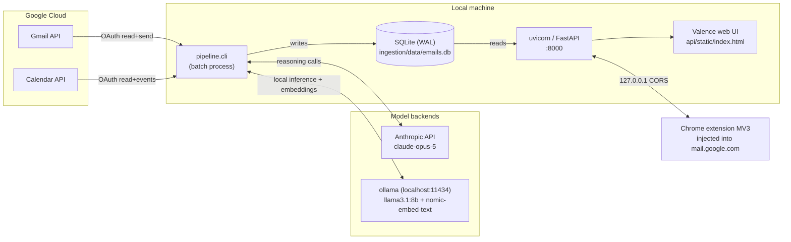
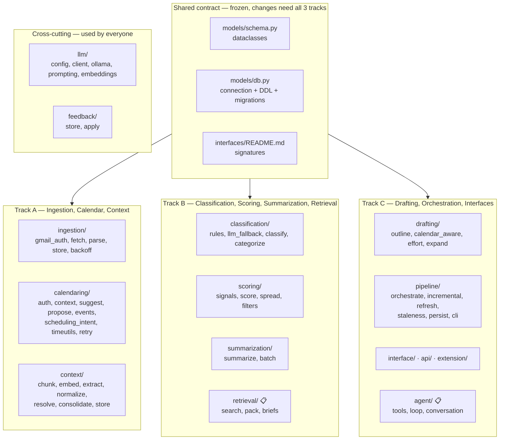
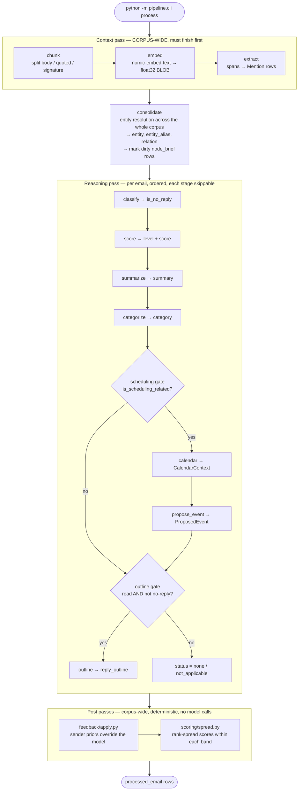
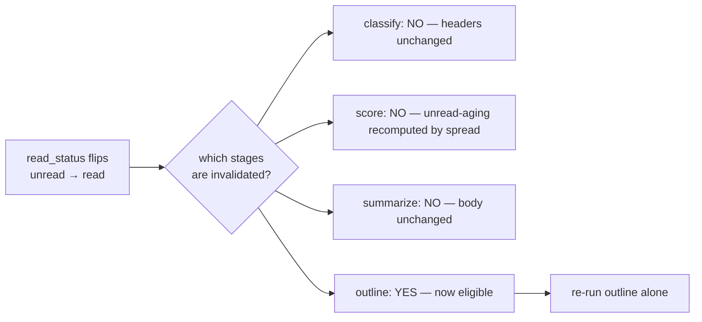
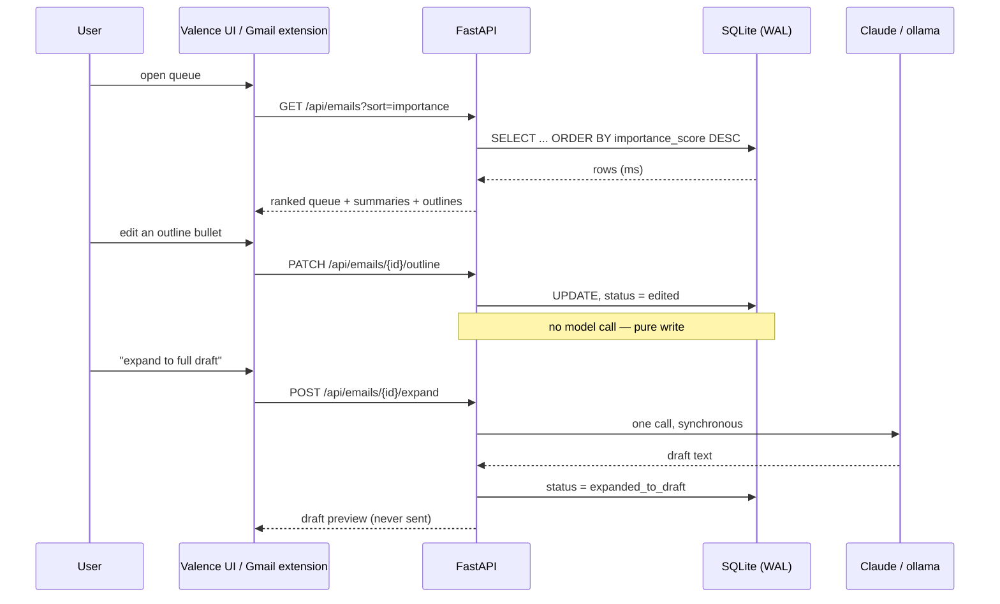
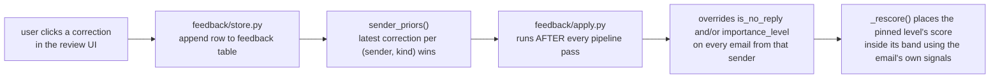

# ARCHITECTURE.md — Valence

The system architecture for the Valence AI email agent. This is the technical
source of truth: what runs, how data moves, where state lives, which decisions
were made and what was rejected.

**Companion docs.** `PRODUCT.md` (who it's for), `DESIGN.md` (the visual
system), `CONTEXT.md` (track ownership + the original 8-phase plan),
`PHASES-COMPLEX.md` (the context-graph/agent build plan),
`interfaces/README.md` (per-module function signatures), `FILE-TREE.md`
(directory layout). This document sits above all of them.

**Status legend.** Every component below is marked:

| Mark | Meaning |
|---|---|
| ✅ | Shipped on `main`, tested, running |
| 🚧 | In flight — partially built, on a track branch |
| 📋 | Specified in `PHASES-COMPLEX.md`, not yet built |

---

## 1. The thesis

Valence is a **batch-processing pipeline with a thin serving layer**. That
split is the single most important architectural fact about it, and almost
everything else follows from it.

Processing an inbox costs minutes and many model calls. Serving a ranked queue
costs milliseconds and reads rows a batch job already wrote. Keeping those two
workloads in separate processes means:

- No HTTP request ever blocks on an LLM call, so there is no job queue, no
  worker pool, no long request timeouts, and no websocket needed for the core
  product.
- The API is stateless over SQLite in WAL mode, so it can be restarted, moved,
  or replaced without touching the pipeline.
- A pipeline failure degrades the product to "stale data" rather than "down".

The second-most important fact: **hard rules live in code, never in prompts.**
Whether an email is eligible for a reply outline, whether a no-reply email can
be scored urgent, whether a user's correction wins over the model — all of that
is deterministic Python that runs *after* the model has spoken. A prompt
instruction drifts; a code gate does not.

---

## 2. Deployment topology

Everything runs on one machine today. There is no server, no cloud database,
and no multi-tenant surface.



### Runtime processes

| Process | Command | Lifetime | Talks to |
|---|---|---|---|
| Ingestion ✅ | `python -m ingestion.cli ingest` | Seconds–minutes | Gmail API, SQLite |
| Pipeline ✅ | `python -m pipeline.cli process` | Minutes | SQLite, Claude/ollama, Calendar API |
| Context pass ✅ | `python -m context.cli build` | Minutes | SQLite, ollama (embeddings), Claude (extraction) |
| API server ✅ | `uvicorn api.main:app --port 8000` | Long-running | SQLite (read-mostly) |
| ollama 🚧 | `ollama serve` | Long-running | — (optional; only if `LLM_PROVIDER=ollama`) |

The Chrome extension is not a process we run — it is loaded unpacked into
Chrome and reaches the API over `http://127.0.0.1`.

---

## 3. Component map and ownership

Three people, three branches, disjoint folders, one frozen contract. The
ownership boundary is enforced socially (a PR touching another track's folder
is a signal the split is wrong), not by tooling.



### Module reference

| Module | Status | Responsibility | Key constraint |
|---|---|---|---|
| `models/schema.py` | ✅ | The frozen dataclass contract | Append-only. All datetimes are tz-aware UTC. Context-graph types are `frozen=True`. |
| `models/db.py` | ✅ | Single connection factory, all DDL, forward migrations | Nothing in the repo calls `sqlite3.connect` directly. |
| `ingestion/` | ✅ | Gmail OAuth, paginated fetch, MIME→plaintext, `raw_email` rows | Rate-limit backoff lives in `backoff.py`; calendaring wraps it rather than duplicating. |
| `calendaring/` | ✅ | Free/busy, slot suggestion, scheduling intent, event proposal + creation | Named `calendaring/`, not `calendar/` — the latter shadows the stdlib and breaks `requests`. |
| `classification/` | ✅ | No-reply detection (rules → LLM fallback), topic categorization | Header rules are cheap and run first; the model is the fallback, not the default. |
| `scoring/` | ✅ | Rule signals → LLM level → deterministic in-band score → rank spread | Score and level can never disagree; see §7.3. |
| `summarization/` | ✅ | 1–3 sentence factual summaries, batched | — |
| `drafting/` | ✅ | Reply outlines behind a code gate, calendar-aware bullets, expand-to-draft | `is_eligible()` is pure and side-effect free. |
| `pipeline/` | ✅ | Two-pass orchestration, incremental re-run, staleness, persistence | Contains no prompts and no SQL — it sequences other tracks' functions. |
| `context/` | ✅ | Chunking, quote/signature stripping, embeddings, entity extraction + resolution, graph consolidation | Only `BODY` chunks are embedded and mined. |
| `llm/` | ✅ | Provider abstraction, per-stage routing, prompt helpers, embeddings | Every model call goes through `get_client(stage)`. |
| `feedback/` | ✅ | Sender priors from user corrections, applied deterministically post-run | Runs after the model; the user's correction has the last word. |
| `api/` | ✅ | FastAPI read/edit layer + static Valence UI | Read-mostly. No endpoint runs the full pipeline synchronously except explicit refresh. |
| `interface/` | ✅ | CLI review interface + shared filters | — |
| `extension/` | ✅ | MV3 Chrome extension injecting Valence into Gmail | `host_permissions` limited to loopback. |
| `retrieval/` | 📋 | Hybrid BM25+vector+graph search, RRF fusion, `build_pack()`, rollup briefs | The single entry point every context consumer calls. |
| `agent/` | 📋 | Claude tool-use loop, conversation persistence, streaming transport | Tools are the only way the agent touches data. |

---

## 4. Data flow

### 4.1 The two-pass pipeline

This ordering is load-bearing and is the subtlest thing in the system.



**Why two passes and not one longer stage list.** Extraction builds the entity
graph that the reasoning stages retrieve from. If the two were interleaved
per-email, email #1's outline would be generated against a graph that knows
only about email #1, while email #160's would see everything. The correlation
the graph exists to provide would be available to the last message in a run and
absent from the first. Hence two entry points (`run_context`, then `process`),
and hence `CONTEXT_STAGES` is deliberately *not* appended to `STAGES` in
`pipeline/orchestrate.py`.

**Why the post-passes are last and deterministic.** Score spreading is a
property of the whole inbox, not of one email — no single-email prompt can
produce separation. Feedback priors must beat the model, so they run after it.

**Why every stage is wrapped.** One email failing classification must not abort
a 100-email run. A stage failure leaves its field `None`, which is exactly what
"not processed yet" looks like, so the next run retries it. This is why nullable
columns matter: they distinguish *unprocessed* from *processed, result was none*.

### 4.2 Incremental re-run

Reprocessing 100 emails because one was marked read costs ~100× more than it
should. `pipeline/incremental.py` answers two questions: does this email need
work at all, and if so, which stages.



A stage is also "due" when its output field is still unset — the `_STAGE_OUTPUT`
map in `incremental.py` is the mapping from stage name to the field it fills.
Terminal states are never re-run: an `APPROVED` `ProposedEvent` may already
carry a live `google_event_id`, and `DECLINED` is a recorded user decision, not
a value the pipeline owns.

### 4.3 Serving path



The only endpoints that make model calls are `/expand`, `/refresh`, and
`/emails/{id}/refresh`. Everything else is a database read or write.

### 4.4 Planned: retrieval and the agent 📋

```
raw_email ──chunk──> chunk ──embed──> chunk_vec        (local nomic-embed-text)
                       ├──fts───────> chunk_fts        (FTS5, free)
                       └─extract────> mention ──resolve──> entity ──> relation
                                                              │
                                              consolidate ────┴──> node_brief
                                                                   (thread/case/project/person)
                                          ┌───────────────────────────┘
                       retrieval.pack ────┤  BM25 + vector + graph-walk, RRF-fused
                                          └──> ContextPack (char-budgeted, cited)
                                                    │
                        ┌───────────────────────────┼──────────────────┐
                   outline.py              summarize.py           agent/loop.py
                (context-aware)         (context-aware)        (Claude tool loop)
```

`ContextPack` is the *only* shape an LLM prompt ever sees context in. That
gives exactly one place where a character budget is enforced and exactly one
place where provenance is attached.

---

## 5. Data model and storage

### 5.1 Why SQLite

One user, one machine, ~160 emails, read-mostly serving. SQLite in WAL mode
lets the API read while the pipeline writes. Everything goes through
`models/db.py:connect()` and the DDL registry, so moving to Postgres later
means changing one module rather than hunting `sqlite3.connect` across the repo.

### 5.2 Table reference

**Core tables** ✅

| Table | Rows | Purpose | Notable indexes |
|---|---|---|---|
| `raw_email` | 1 per Gmail message | Ingestion output. Body as plaintext, headers as JSON. | `received_at DESC`, `thread_id` |
| `processed_email` | 1 per message | Everything the pipeline derives. Nullable columns = "stage hasn't run". | `importance_score DESC`, `received_at DESC`, `read_status` |
| `feedback` | 1 per correction | Append-only event log of user corrections. | `(sender, kind, created_at)` |

**Context graph tables** ✅ (schema shipped; population in progress)

| Table | Purpose | Notable constraint |
|---|---|---|
| `chunk` | One embeddable span of one email | `kind ∈ (body, quoted, signature)` |
| `chunk_fts` | FTS5 external-content index over `chunk.text` | Triggers on insert/delete/update are **mandatory**, not a convenience — without them the index and table drift silently and `MATCH` returns rows whose text no longer exists |
| `chunk_vec` | float32 LE BLOB per chunk | `dim` stored alongside so a model swap is detectable |
| `entity` | Resolved graph node | `UNIQUE (kind, normalized_key)` — scoped by kind on purpose, so a PERSON "Atlas" and a PROJECT "Atlas" never collapse |
| `entity_alias` | Every surface form ever seen for an entity | Lets a later mention match without an embedding comparison |
| `entity_vec` | Entity name embedding, for fuzzy resolution | — |
| `mention` | One occurrence of one entity in one email | `source ∈ (header, regex, llm)` so a bad regex is distinguishable from a hallucination |
| `relation` | Weighted, evidenced edge | PK `(src, dst, rel)`; `evidence_email_ids` is what makes an edge auditable |
| `node_brief` | Cached LLM-written state document per thread/case/project/person | PK `(node_type, node_id)`; `evidence_hash` is the cache key |
| `agent_conversation` / `agent_message` | The in-app agent's chat log | Lives in the DB because Gmail is a SPA that remounts content scripts constantly — in-memory chat state does not survive clicking between messages |

### 5.3 Vectors without a vector extension

This interpreter's `sqlite3` is built **without** `enable_load_extension`, so
`sqlite-vec` and `sqlite-vss` cannot be loaded at all. Vectors are therefore
float32 little-endian BLOBs, read into one contiguous numpy matrix, with
brute-force cosine.

Sizing check: ~160 emails ≈ ~1,500 chunks × 768 dims × 4 bytes ≈ **4.6 MB**.
A dot product over that is ~5 ms. An ANN index would be complexity with no
payoff. FTS5 *is* available and is used for real.

### 5.4 Migrations

Two mechanisms, deliberately separate:

- **New tables** → `CREATE TABLE IF NOT EXISTS` in `ALL_SCHEMAS`. Nothing else
  needed; adding a table is not a migration.
- **New columns on a shipped table** → an entry in the `MIGRATIONS` dict,
  applied on every open. A database written by an earlier version keeps working
  instead of failing on an unknown column.

`prepare()` is cheap and idempotent, so call sites just call it rather than
tracking whether initialization already happened.

### 5.5 Schema invariants

These hold everywhere and are worth stating explicitly:

1. **Every datetime in the contract is timezone-aware UTC.** `received_at` comes
   from Gmail's `internalDate`, an absolute instant. Mixing naive and aware
   datetimes raises `TypeError` on comparison — a defect that once made
   `scoring/signals.py` crash on real mail. `datetime.utcnow()` is banned;
   use `datetime.now(timezone.utc)`.
2. **`None` means "not processed yet", never "processed, result was none".**
   This is what makes retry-on-next-run correct.
3. **`_level_from_score(importance_score) == importance_level`** always. Score
   spreading preserves it; feedback rescoring preserves it.
4. **A no-reply email never holds a `reply_outline`.** Enforced in the outline
   gate *and* re-enforced in `feedback/apply.py`.
5. **Context-graph dataclasses are `frozen=True`.** Unlike `ProcessedEmail`
   (filled in field by field as stages run), a `Chunk` or `Mention` is derived
   wholly in one pass and then only ever replaced. Use `dataclasses.replace`.

---

## 6. The LLM layer

### 6.1 Provider abstraction

One function — `llm.client.get_client(stage)` — returns an Anthropic-shaped
client, real or local. Both backends expose
`.messages.create(model=, max_tokens=, system=, messages=, output_config=)`
and return an object whose `.content` is a list of blocks with `.type` and
`.text`. Call sites are identical; only config differs.

Before this, four call sites each constructed `anthropic.Anthropic()` directly,
so switching providers meant editing four files.

### 6.2 Per-stage routing

```
LLM_PROVIDER=ollama              # default backend for everything
LLM_PROVIDER_OUTLINE=anthropic   # …except outlines
LLM_MODEL_EXTRACT=claude-sonnet-5 # …and extraction uses a cheaper model
```

Routable stages: `classify`, `score`, `summarize`, `categorize`, `outline`,
`extract`, `brief`, `agent`. The hybrid split is the point — high-volume
mechanical work (classify, score, summarize, extract) can run against a local
model for free while the handful of calls where judgment is visible (outline,
agent) stay on a hosted one. That is two environment variables, not a code
branch.

| Setting | Default |
|---|---|
| `ANTHROPIC_MODEL` | `claude-opus-5` |
| `OLLAMA_MODEL` | `llama3.1:8b` |
| `OLLAMA_HOST` | `http://localhost:11434` |
| `OLLAMA_TIMEOUT` | `300`s — a cold model load must not read as a failure |
| `OLLAMA_REPEAT_PENALTY` | `1.3` — without it a small model loops inside a JSON string under constrained decoding and burns the whole token budget without closing the quote |
| `EMBED_MODEL` | `nomic-embed-text` |

`llm/ollama.py` has **no tool-calling support**. The agent loop is
Anthropic-only.

### 6.3 The reason-before-answer rule

Every JSON schema for a model call must declare its reasoning field **before**
the answer field:

```python
RESPONSE_SCHEMA = {
    "type": "object",
    "properties": {
        "justification": {"type": "string", "maxLength": 300},  # FIRST
        "importance_level": {"type": "string", "enum": [...]},   # SECOND
    },
    "required": ["justification", "importance_level"],
    "additionalProperties": False,
}
```

Under constrained decoding the model emits fields in declaration order. Reason
first means the reasoning *informs* the answer. Answer first means the level is
committed and the reasoning merely rationalizes it. This is not a style
preference — do not "tidy" the order.

Every string field carries a `maxLength`, which constrained decoding enforces
structurally. That makes a repetition loop inside a string field impossible,
which is a real failure mode on small local models.

### 6.4 Prompt construction

`llm/prompting.py:email_identity_block` builds the From/To/Subject header every
stage uses, so identity formatting is defined once. Bodies are truncated at
`MAX_BODY_CHARS = 2000` for scoring — measured: the two biggest bodies in a
12-email run were the two misjudged levels, and the level-relevant information
lives in the sender, subject, signals, and the opening of the body.

### 6.5 Planned: hybrid retrieval 📋

Three channels into the same graph, fused with Reciprocal Rank Fusion:

| Channel | Answers | Fails at |
|---|---|---|
| **BM25** (FTS5) | exact terms — ticket IDs, PO numbers, names | paraphrase |
| **Vector** (cosine over `chunk_vec`) | paraphrase, fallback recall | short corpora, identity joins |
| **Graph walk** (`relation` edges, ranked by `salience`) | "everything touching this case" with certainty | anything not yet extracted |

Fusion is RRF because the three channels produce incomparable scores — BM25
magnitudes and cosine similarities cannot be linearly combined without an
arbitrary calibration constant. Rank-based fusion sidesteps that entirely.

`build_pack()` then assembles a char-budgeted `ContextPack` of labelled
`ContextSection`s. Each section carries provenance ("From X, date, re: Y")
because without it a model blurs facts from several emails together instead of
citing them, and a wrong claim can't be traced to its source.

---

## 7. Learning and adaptation

**No model weights are trained anywhere in this system.** There is no training
set, no fine-tuning job, no gradient descent, no evaluation harness producing
checkpoints. Every model involved is used as-is:

| Model | Role | Provenance |
|---|---|---|
| `claude-opus-5` / `claude-sonnet-5` | Classification fallback, scoring, summarization, extraction, outlines, agent loop | Hosted, frozen weights, prompted only |
| `llama3.1:8b` | Optional local substitute for the same stages | Downloaded via ollama, unmodified |
| `nomic-embed-text` | Embeddings for chunks and entity names | Downloaded via ollama, unmodified |

What *does* adapt is everything around the models. There are four distinct
mechanisms, and conflating them is the main risk when reasoning about behavior.

### 7.1 Sender priors — the real feedback loop ✅

The only mechanism that learns from the user.



Two correction kinds: `level` (pin this sender to low/medium/high/urgent) and
`no_reply` (this sender is automated / is a real person).

**Why deterministic priors and not few-shot prompt examples.** The measured
misclassifications are *sender-shaped* — a tracker, an order bot, a newsletter
the rules call "personal". A stored override fixes every future email from that
sender with certainty. No prompt example can promise that on a small model, and
adding examples to a prompt makes every future call more expensive forever.
This is the same philosophy as the outline gate: user-stated rules live in code.

Note the invariant maintenance in `apply.py` — pinning a sender to no-reply also
clears any existing outline and sets status to `not_applicable`, because rule 4
of §5.5 must hold after the override, not just before it.

### 7.2 Hand-tuned rule signals ✅

`scoring/signals.py` computes VIP membership, direct-vs-CC, urgency keyword
hits, thread recency, and unread-aging decay. These are **configured**, not
learned. The within-band weights are hand-set constants that sum to 1.0:

| Signal | Weight | Note |
|---|---|---|
| `is_vip` | 0.30 | |
| `is_direct` | 0.20 | direct recipient beats CC |
| `urgency` | 0.30 | up to 3 keyword hits count |
| `unread_age` | 0.15 | saturates at 72h unread |
| `recency` | 0.05 | fresher mail ranks slightly higher |

Changing these is a code change reviewed like any other, not a training run.

### 7.3 The score/level split ✅

Worth its own subsection because it is easy to misread as a scoring model.

The **LLM picks the level** (low/medium/high/urgent) from four calibration
anchors baked into the system prompt. The level selects a 25-point band
(`LEVEL_BANDS`). Then `_score_within_band()` places a **deterministic** score
inside that band using the rule signals above.

```
LLM  →  level  →  band  →  rule signals  →  score
       (judgment)          (arithmetic)
```

This is why score and level can never disagree, and why the numeric score is
reproducible from stored signals without another model call. The model is
never asked for a number — models are poor at calibrated numeric output and
would cluster everything around 70.

### 7.4 Corpus-relative rank spreading ✅

`scoring/spread.py` fixes a problem no per-email scorer can: any scorer
produces clustered scores, because similar emails carry similar signals. The
last measured run put every email between 20 and 34 with big ties at exactly
0.0 and 25.0. Ranking needs *separation*, and separation is a property of the
whole inbox.

So after scoring, within each level, scores are re-mapped to an even
distribution across that level's band, preserving the order the raw scores
(and recency, as tiebreak) established. The level never changes, scores stay
strictly inside their band, and the mapping is idempotent.

### 7.5 Threshold tuning 🚧

Entity resolution has two thresholds that were set empirically against the
`CORPUS-WORLD.md` test corpus, not learned:

| Constant | Value | Meaning |
|---|---|---|
| `DEFAULT_THRESHOLD` | 0.86 | cosine similarity to merge two entity candidates |
| `CONTAINMENT_THRESHOLD` | 0.65 | relaxed bar, applied *only* when one key is a whole-token subsequence of the other ("Henderson escalation" ⊂ "the Henderson escalation issue") |

Tuning these is A7 in `PHASES-COMPLEX.md` and is done by inspecting the graph
via `python -m context.cli`, which is explicitly the go/no-go gate before
anything downstream is trusted.

### 7.6 What would count as training, and why we don't do it

A learned importance ranker is plausible — the `feedback` table is exactly the
label store you'd need. It is not worth it at this scale: one user, ~160
emails, and a handful of corrections. A logistic regression over five signals
fit on twelve labels is noise. The deterministic prior gets the same outcome
with certainty and zero infrastructure. Revisit if the feedback table reaches
hundreds of rows across many senders.

---

## 8. Security, auth, and human-in-the-loop

### 8.1 OAuth scopes

Two separate token files, because Google issues one token per scope set.

| Service | Scopes requested | Code paths that exist today |
|---|---|---|
| Gmail | `gmail.readonly`, `gmail.send` | read only — `gmail.send` is requested but **never called** |
| Calendar | `calendar.readonly`, `calendar.events` | read + `create_event`, reachable only via explicit user approval |

Write scopes are requested at first consent on purpose: the alternative is
prompting the user for a second consent screen when send/create-event ships,
which is a worse experience for no security benefit. **Requesting a scope is
not exercising it** — the write code paths are separately gated.

### 8.2 Secrets

`client_secret_*.json`, `token.json`, `token_calendar.json`, `token_gmail.json`,
and `.env` are all gitignored (verified: nothing matching is tracked). Tokens
live on the local filesystem only. `ingestion/data/` — the entire SQLite
database, i.e. the full text of the user's mail — is also gitignored.

### 8.3 Human-in-the-loop invariants

These are product-critical and enforced structurally:

| Invariant | Enforced by |
|---|---|
| Nothing is ever sent automatically | No send code path exists; `expand` produces a preview only |
| No calendar event is created without an explicit click | `ProposedEventStatus` starts at `suggested`; `create_event` is called only from the approve endpoint |
| Unread mail never gets a reply outline | `drafting/outline.py:is_eligible` — pure function, tested |
| No-reply mail never gets a reply outline, ever | Same gate, plus re-enforced in `feedback/apply.py` |
| Unclassified mail is treated as ineligible | Same gate — a `None` `is_no_reply` must not let a no-reply email slip through |
| A user-approved or user-declined event is never overwritten | `_TERMINAL_EVENT_STATUSES` in `orchestrate.py` |

### 8.4 Extension attack surface

MV3, `host_permissions` restricted to `http://127.0.0.1/*` and
`http://localhost/*`, content scripts matched to `https://mail.google.com/*`
only, and `permissions: ["storage"]` — nothing else. The extension cannot reach
any remote host. It reads from a local API that reads a local database.

---

## 9. Failure modes and degradation

The governing rule from Phase 8: **graceful degradation over crashes.**

| Failure | Behavior | Recovery |
|---|---|---|
| One email fails a stage | That field stays `None`; run continues | Next run retries that stage for that email |
| Gmail rate limit (429) | Exponential backoff in `ingestion/backoff.py` | Automatic |
| Calendar API down | `calendaring/retry.py` (wraps the same backoff); on exhaustion `calendar_context` stays `None` | Email still ranks, summarizes, and gets a non-calendar-aware outline |
| ollama not running | `get_client` raises at the call site; the stage fails, others continue | Start ollama, or switch `LLM_PROVIDER=anthropic` |
| Model returns malformed JSON | Constrained decoding prevents most; a bad response now fails only that email's extraction rather than the whole run (commit `871dcd3`) | Next run |
| Email with no body / attachments only | Parsed to empty string; stages handle it | — |
| New message arrives in a thread with an existing outline | `pipeline/staleness.py:find_stale_outlines` computes staleness from `thread_id` + `received_at` | Surfaced in the UI; regenerate on demand |
| Pipeline crashes mid-run | Rows already written are committed; nothing is left half-written per email | Re-run; incremental logic skips completed work |
| API and pipeline run concurrently | WAL mode — API reads while pipeline writes | — |

Note on staleness: there is no persisted `stale` status, because
`ReplyOutlineStatus` is part of the frozen contract and adding a member needs
all three tracks' sign-off. It is computed at read time from data already
present.

---

## 10. Performance and cost

### 10.1 Latency budget

| Operation | Cost |
|---|---|
| Serving one queue page | milliseconds — indexed SELECT |
| Vector similarity over the whole corpus | ~5 ms (brute-force numpy) |
| Ingest 50 emails | seconds |
| Full pipeline over 160 emails | minutes — dominated by model calls |
| Expand one outline to a draft | one synchronous model call |

### 10.2 Model call budget

| Workload | Calls |
|---|---|
| One-time entity extraction over the corpus | ~160 (a mid-tier model is correct here; Opus is overkill for span extraction) |
| Embeddings | ~1,500 texts, local, free |
| Initial rollup briefs | ~30–60 |
| Steady state | one extraction call per new email, plus affected briefs only |
| Per email per full reasoning pass | up to 5 (classify fallback, score, summarize, categorize, outline) — several skipped by gates |

The two gates that save the most: the scheduling gate (most mail isn't
scheduling-related, so most emails never touch the Calendar API) and the
outline gate (unread and no-reply mail never reaches the outline model call at
all).

The `evidence_hash` on `node_brief` is the other big saver — an unchanged hash
means the brief is still true, so regenerating it would be a paid call for no
new information.

---

## 11. Testing strategy

**748 tests across 51 files**, all offline: no network, no model calls, no
Google API.

| Pattern | Where |
|---|---|
| Scripted service doubles | `calendaring/tests/fakes.py`, `context/tests/fakes.py` — the reference pattern |
| Shared fixtures, not per-test duplicates | `calendaring/samples.py` is used by both the CLI's `--offline` mode and the tests |
| Pure functions isolated for the bug-prone parts | `calendaring/timeutils.py` — RFC-3339 offsets, all-day dates, overlapping busy blocks, tz-correct working hours — testable with no client |
| Gate correctness as explicit assertions | `drafting/tests/test_outline_gating.py` covers unread / no-reply / eligible / scheduling |
| Idempotence and invariants | `scoring/tests/test_spread.py` asserts spreading twice is a no-op and levels never change |

`pytest -q` is the gate before any "I'm done".

---

## 12. Architecture decision records

Each records what was chosen, what was rejected, and why the rejected option
was genuinely considered.

**ADR-001 — Batch pipeline + thin serving layer, not request-time processing.**
Rejected: generating summaries and outlines on demand per request. That would
put a multi-second model call in the HTTP path, requiring a job queue, workers,
and progress UI to be usable. The workload genuinely splits — processing is
minutes and occasional, serving is milliseconds and constant — so splitting the
processes is free correctness.

**ADR-002 — SQLite, not Postgres.** One user, one machine, ~160 emails. WAL
mode gives concurrent read-during-write, which is the only concurrency
requirement. All access routes through `models/db.py`, so the swap is one
module if it ever matters.

**ADR-003 — Entity-centric graph in SQLite, not a vector database.** Rejected:
pure vector store. What's needed is *a join on identity, not a join on
similarity*. Two emails belong to the same case even when they share almost no
vocabulary — "the Henderson escalation", "ticket 4471", and a forwarded invoice
with a PO number. Cosine scores those three as unrelated; an exact key links
them with certainty. At 160 emails there also isn't enough text for semantic
similarity to be the differentiator. Embeddings still earn their place as *a
channel into* the graph — for entity resolution and fallback recall — not as
the architecture of it.

**ADR-004 — Graph, not a tree.** Rejected: hierarchical thread→case→project
tree. Email context isn't a tree: one email touches several cases, one person
spans many projects, a thread forks into two workstreams. Forcing a tree means
picking one parent and discarding the other edges — exactly the correlation
we're trying to capture. Roll-ups (`node_brief`) are tree-shaped even though
the edges underneath are a DAG.

**ADR-005 — Two-pass refresh ordering.** Rejected: one long stage list with
extraction inline. See §4.1 — inline extraction gives the last email in a run
a full graph and the first email almost none.

**ADR-006 — float32 BLOBs + numpy, not a vector extension.** Not a preference:
this interpreter's `sqlite3` lacks `enable_load_extension`, so `sqlite-vec` and
`sqlite-vss` *cannot load*. At 4.6 MB brute force is ~5 ms, so an ANN index
would be complexity with no payoff.

**ADR-007 — Reply outlines, not full drafts, by default.** Rejected:
always-generate a full draft. Outlines are cheaper, faster to scan and approve,
and avoid handing the user an AI-voiced paragraph they must either send as-is
or heavily rewrite. Full-draft expansion stays available on demand.

**ADR-008 — Code-level gating, not prompt-level.** Rejected: "never draft for
unread or no-reply email" as a system-prompt instruction. Prompt instructions
drift, especially on small local models; a deterministic check does not. This
is why `is_eligible()` is a pure function and why `feedback/apply.py` re-asserts
the same rule after overriding a sender.

**ADR-009 — Cheap scheduling gate before the Calendar API.** Rejected: calling
Calendar for every email. Most mail isn't scheduling-related; a keyword/intent
check avoids paying API and latency cost on the majority.

**ADR-010 — LLM picks the level, code computes the score.** Rejected: asking
the model for a 0–100 number. Models produce poorly calibrated numbers and
cluster them. Level-then-band-then-signals makes score reproducible from stored
data and makes score/level disagreement structurally impossible.

**ADR-011 — Rank spreading as a separate corpus-wide pass.** Rejected: tuning
per-email weights to spread scores. Separation is a property of the inbox, not
of any email; no single-email computation can produce it.

**ADR-012 — Deterministic sender priors, not few-shot examples.** See §7.1.

**ADR-013 — Write OAuth scopes requested at first consent.** Rejected: adding
scopes later. The re-consent prompt is a worse experience for no security
benefit, since the write code paths are separately gated regardless.

**ADR-014 — `calendaring/`, not `calendar/`.** A top-level `calendar` package
shadows the stdlib module. `http.cookiejar` does `from calendar import timegm`
at import time, so the shadow breaks `requests`, which breaks `google-auth`'s
transport — surfacing as a misleading "The requests library is not installed".
Reproduced against this repo's venv before renaming.

**ADR-015 — Reason-before-answer field ordering.** See §6.3.

**ADR-016 — Agent conversation state in SQLite, not in the extension.** Gmail
is a SPA that remounts content scripts constantly; in-memory chat state does
not survive the user clicking between messages.

**ADR-017 — Single self-contained HTML page, no frontend build.** `api/static/index.html`
is one file with no bundler, no npm, and no build step. At this scope a build
pipeline costs more than it returns, and the API can serve the UI directly.

---

## 13. Known gaps

| Gap | Impact | Where it's addressed |
|---|---|---|
| `api/filters.py` "search" is a Python substring scan over every row loaded into memory | Doesn't scale, misses paraphrase | Replaced by hybrid retrieval — B2/B7 |
| `thread_id` is stored and indexed on both tables but never joined on | Sibling messages in a thread are invisible to every prompt | B2's graph channel; thread history is the cheapest edge in the graph |
| Some `scoring/signals.py` signals are computed but don't reach the model | Wasted computation, weaker ranking | B6 — "fix the dead scoring signals" |
| `retrieval/` and `agent/` don't exist yet | No cross-thread context, no in-app agent | Tracks B and C of `PHASES-COMPLEX.md` |
| `llm/ollama.py` has no tool-calling | The agent loop is Anthropic-only | Accepted; local models are for the mechanical stages |
| No persisted "stale outline" status | Staleness recomputed at read time | Accepted — would be a frozen-contract change |
| Single-user, single-machine throughout | No multi-tenancy, no auth on the API | By design; out of scope |

---

## 14. Quick reference

```bash
# 0. Pick a backend
export LLM_PROVIDER=ollama OLLAMA_MODEL=llama3.1:8b   # local, free; needs `ollama serve`
export ANTHROPIC_API_KEY=...                          # or hosted

# 1. Ingest
python -m ingestion.cli ingest

# 2. Build the context graph — INSPECT IT before trusting anything downstream
python -m context.cli build
python -m context.cli entities
python -m context.cli email <email_id>

# 3. Reasoning pass
python -m pipeline.cli process

# 4. Serve the UI and the API
uvicorn api.main:app --reload --port 8000
#   http://localhost:8000/       Valence review UI
#   http://localhost:8000/docs   interactive API docs

# Diagnostics
python -m llm.cli describe      # which model each stage will use
pytest -q                       # 748 tests, all offline
```

### API surface ✅

| Method | Path | Model call? |
|---|---|---|
| `GET` | `/api/health` | no |
| `GET` | `/api/emails` | no |
| `GET` | `/api/emails/{id}` | no |
| `GET` | `/api/stats` | no |
| `PATCH` | `/api/emails/{id}/outline` | no |
| `POST` | `/api/emails/{id}/feedback` | no |
| `POST` | `/api/emails/{id}/expand` | **yes** |
| `POST` | `/api/emails/{id}/refresh` | **yes** |
| `POST` | `/api/refresh` | **yes** |
| `POST` | `/api/emails/{id}/calendar-event/approve` | no (Calendar API write) |
| `POST` | `/api/emails/{id}/calendar-event/decline` | no |
